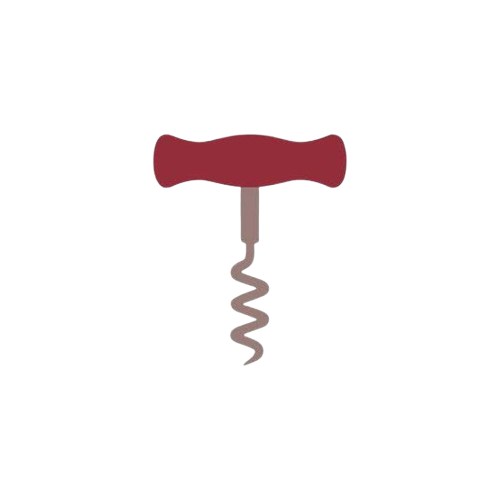

# Corkscrew



Corkscrew is a simple Linux application for managing and launching Windows .exe programs using Wine.


## Description


* run exe files quickly.
* run it in windowed mode or fullscreen mode if it supports it.


### Dependencies

* python
* wine

### Installing

* just run the ```setup file```
  or
  ```
  chmod  +x setup.sh
  ./setup.sh
  
  ```

and after that you can run exe files quickly

  
## Help

if for some reason it doesnt allow you to double click. its probably the file manager and how it handles file types

* nemo
  * try turning off the ```allow execute progam```  on the ```permissions```  tab when right clicking on ```properties``` 


## Author

* kingrain

## Version History

* 0.1
    * Initial Release 

## License

This project is licensed under a license.  see the LICENSE.md file for details

